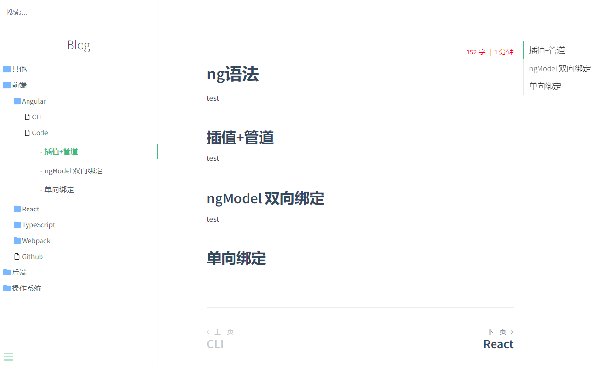

# 🐵 DocsifyBuildSidebar For C#

自动生成 docsify 的 sidebar  和 每个子目录中的 sidebar

[Docsify官网](https://docsify.js.org/#/zh-cn/)

```
用golang复刻的源码
https://github.com/xxxxue/GoBuildDocsifySidebar
Releases中文件支持 3大主流平台, golang可执行文件较小,方便下载.
```

# 网站的部署
- Vercel (免费全自动部署): 直接关联github私有/公有仓库,nodejs那几个命令不用填, 直接部署即可,3秒即可成功.每次提交代码,Vercel都会自动部署.
- Github Page: 国内访问太慢了.
- Gitee Pages (码云) : 比较辣鸡,白嫖党需要每次手动点击更新. 而且还有违禁违规内容审查, 我笔记里的汇编代码 被认为是违规内容??? 不让我部署.总不能把笔记删掉吧,后来就一直没有部署.都是本地去查看,再后来我发现了Vercel, 用过后只想说 Vercel YYDS !

---
还没使用过的平台
- GitCode : CSDN旗下的代码托管平台 https://gitcode.net/
- Netlify : 国外的一个平台 https://www.netlify.com/
- Coding Pages : 腾讯旗下的一个代码托管平台 https://coding.net/

#  使用方法:
>
> 1. 在github页面右侧的"Releases" 中下载编译好的软件
> 2. 修改Config中的`HomePath`为 `自己电脑上的目标根目录`
> 3. 双击exe执行

# 小技巧:
可以右键单击exe,创建一个 快捷方式, 

把这个`快捷方式`剪切到自己的项目根目录,

以后就不用每次都去找 exe 了


# 首页效果

```markdown
- [C_Sharp](C_Sharp/)
  - [TestPaper](C_Sharp/TestPaper/)
    - [1](C_Sharp/TestPaper/1.md)
    - [2](C_Sharp/TestPaper/2.md)
  - [Docker](C_Sharp/Docker.md)
  - [EFCore](C_Sharp/EFCore.md)
  - [Furion](C_Sharp/Furion.md)
  - [RX](C_Sharp/RX.md)
  - [SpectreConsole](C_Sharp/SpectreConsole.md)
  - [Utils](C_Sharp/Utils.md)
- [Java](Java/)
  - [Github](Java/Github.md)
- [JavaScript](JavaScript/)
  - [AutoJs](JavaScript/AutoJs/)
    - [code](JavaScript/AutoJs/code.md)
    - [test1](JavaScript/AutoJs/test1/)
      - [te](JavaScript/AutoJs/test1/te.md)
      - [test2](JavaScript/AutoJs/test1/test2/)
        - [aaa](JavaScript/AutoJs/test1/test2/aaa.md)
  - [Docsify](JavaScript/Docsify.md)
  - [Github](JavaScript/Github.md)
- [Ubuntu](Ubuntu/)
  - [Commands](Ubuntu/Commands.md)
```

# 1级子目录

```markdown
- [返回首页](/)
- [C_Sharp](C_Sharp/)
  - [TestPaper](C_Sharp/TestPaper/)
    - [1](C_Sharp/TestPaper/1.md)
    - [2](C_Sharp/TestPaper/2.md)
  - [Docker](C_Sharp/Docker.md)
  - [EFCore](C_Sharp/EFCore.md)
  - [Furion](C_Sharp/Furion.md)
  - [RX](C_Sharp/RX.md)
  - [SpectreConsole](C_Sharp/SpectreConsole.md)
  - [Utils](C_Sharp/Utils.md)
```

## n级子目录

```markdown
- [返回上一级 [C_Sharp]](C_Sharp/)
- [TestPaper](C_Sharp/TestPaper/)
  - [1](C_Sharp/TestPaper/1.md)
  - [2](C_Sharp/TestPaper/2.md)
```

# 界面效果



# docsify index.html 模版

```html
<!-- index.html -->

<!DOCTYPE html>
<html>
  <head>
    <meta http-equiv="X-UA-Compatible" content="IE=edge,chrome=1" />
    <meta name="viewport" content="width=device-width,initial-scale=1" />
    <meta charset="UTF-8" />
    <link rel="stylesheet" href="//cdn.jsdelivr.net/npm/docsify@4/themes/vue.css" />

    <!-- 文件夹样式 -->
    <link rel="stylesheet" href="//cdn.jsdelivr.net/npm/docsify-sidebar-collapse/dist/sidebar-folder.min.css" />
    <!-- 箭头样式 -->
    <!-- <link rel="stylesheet" href="//cdn.jsdelivr.net/npm/docsify-sidebar-collapse/dist/sidebar.min.css" /> -->
  </head>
  <body>
    <div id="app"></div>
    <script>  
      window.$docsify = {
        name: "Blog",
        // 侧边栏文档目录
        loadSidebar: true,

        subMaxLevel: 2,
        alias: {
          "/.*/_sidebar.md": "/_sidebar.md",
        },
        // 跳转后自动到顶部
        auto2top: true,

        coverpage: true,
        // PLUGINS
        // ----------------------------------------------------------------
        // 页面右侧toc
        toc: {
          tocMaxLevel: 2,
          target: "h2, h3, h4, h5, h6",
        },

        // 全文搜索
        search: {
          depth: 6,
          noData: "没有搜到!",
          placeholder: "搜索...",
          // 避免搜索索引冲突,同一域下的多个网站之间
          namespace: "website-1",
        },
        // 底部导航
        pagination: {
          previousText: "上一页",
          nextText: "下一页",
          crossChapter: true,
          crossChapterText: true,
        },
        // 字数统计
        count: {
          countable: true,
          position: "top",
          margin: "10px",
          float: "right",
          fontsize: "0.9em",
          color: "red",
          language: "chinese",
          localization: {
            words: "",
            minute: "",
          },
          isExpected: true,
        },
      };
    </script>
    <!-- docsify -->
    <script src="https://cdn.jsdelivr.net/npm/docsify@4/lib/docsify.min.js"></script>  

    <!-- 代码高亮  https://cdn.jsdelivr.net/npm/prismjs@1/components/ -->
	
    <script src="//cdn.jsdelivr.net/npm/prismjs@1/components/prism-bash.min.js"></script>	
    <script src="//cdn.jsdelivr.net/npm/prismjs@1/components/prism-python.min.js"></script>
    <script src="//cdn.jsdelivr.net/npm/prismjs@1/components/prism-cmake.min.js"></script>
    <script src="//cdn.jsdelivr.net/npm/prismjs@1/components/prism-java.min.js"></script>
    <script src="//cdn.jsdelivr.net/npm/prismjs@1/components/prism-csharp.min.js"></script>     
    <script src="//cdn.jsdelivr.net/npm/prismjs@1/components/prism-docker.min.js"></script>  
	<script src="//cdn.jsdelivr.net/npm/prismjs@1/components/prism-powershell.min.js"></script>  


    <!-- 多tab支持 -->
    <script src="https://cdn.jsdelivr.net/npm/docsify-tabs@1/dist/docsify-tabs.min.js"></script>

    <!-- 代码复制 -->
    <script src="https://cdn.jsdelivr.net/npm/docsify-copy-code@2/dist/docsify-copy-code.min.js"></script>

    <!-- 底部 上一页下一页 -->
    <script src="https://cdn.jsdelivr.net/npm/docsify-pagination@2/dist/docsify-pagination.min.js"></script>

    <script src="https://cdn.jsdelivr.net/npm/docsify@4/lib/plugins/external-script.min.js"></script>

    <script src="https://cdn.jsdelivr.net/npm/docsify@4/lib/plugins/ga.min.js"></script>

    <!-- 全文搜索 -->
    <script src="https://cdn.jsdelivr.net/npm/docsify@4/lib/plugins/search.js"></script>

    <!-- 图片放大缩小 -->
    <script src="https://cdn.jsdelivr.net/npm/docsify@4/lib/plugins/zoom-image.min.js"></script>

    <!-- 字数统计 -->
    <script src="https://cdn.jsdelivr.net/npm/docsify-count@latest/dist/countable.min.js"></script>

    <!-- 侧边栏目录折叠 -->
    <script src="https://cdn.jsdelivr.net/npm/docsify-sidebar-collapse/dist/docsify-sidebar-collapse.min.js"></script>

    <!-- 页面右侧 TOC -->
    <script src="https://cdn.jsdelivr.net/npm/docsify-plugin-toc@1.1.0/dist/docsify-plugin-toc.min.js"></script>

      <!-- emoji -->
      <script src="//cdn.jsdelivr.net/npm/docsify/lib/plugins/emoji.min.js"></script>
  </body>
</html>

```


## 开发环境

> .Net6
>
> VS2022

# 联系方式

> QQ: 1659809758

# 支持作者


